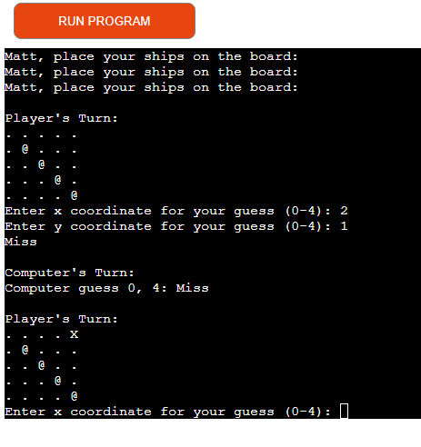

# Battleships

Battleships is a Python terminal game that runs in the Code Institute mock terminal on Heroku.

Players can attempt to sink all the computer's battleships and reign victorious over the seas. However if the computer sinks all the players battleships first it is game over.

Welcome to [https://project-3-matt-wass-9b18f1b1e57e.herokuapp.com/]

## Game Instructions

Battleships is an all time classic game, with various different iterations over the years.

This version starts with the player entering their name.

After the player has entered their name, they will be prompted to select four positions on the board. It has been noted in the introduction that the top left corner is row 0 column 0, to aid the player in the selection of their positions.

The player's ships will be marked with the '@' sign. The computer's battleships will not be visible to the player.

Any guesses are marked on the board with the 'X' sign. While any direct hits are indicated by the '*' sign.

The player and computer will take it in turns to attempt to sink all the battleships on the opposing side.

The winner is the defined by having sunk all the enemy ships.

## Features 

### Board Generation

The player may select their board positions as seen below

Once the first position has been selected, the player will then be prompted to select their remaining board posistions.

Now all the positions have been selected, we can see the game is ready to begin and the enter X and Y coordinates are ready to be guessed.

in the image below both sides missed 

in the image below the computer has hit 

The image below shows that you cannot enter the same coordinates twice and that you cannot enter invlaid coordinates that are outisde of the board sizing.

## Future Features

  - Have battleship sizing larger than 1x1
  - Increase board size and also number of ships on the board

## Testing

 - I have tested the project through the CI python linter, as seen below and the project came back all clear, with no errors found.
  - I have also tested the project in my local terminal as well as the Code Institute Heroku terminal

  

### Bugs

Solved Bugs

 - I had various issues getting the code to pass through the linter at first due  to blankspaces been present in my code. I solved this through the guidance displayed on the CI python linter.
 - My populate_board function was not displaying properly and kept appearing faulty due to me missing a ',' instead of a '.' in my code. Such a small error took me much longer than anticpated to notice.

 ### Remaing Bugs
  - There are now no remaining bugs

  ## Deployment 
  
  My project was deployed using Code Institutes mock terminal for Heroku.

    - Steps taken for deplyment:
      - Cloned repository
      - Created a Heroku app
      - Set releavant buildpacks Python and NodeJS in correct order
      - Linked Heroku app to repository
      - Clicked on Deploy

## Acknowledgements
- Code Institute for the deployment terminal
- Student Care, for all their support and guidance over what has been a very challenging time.
- My family for their unwavering support 

### Content

- Inspiration for my project was taken from the Love Sandwiches project as well as the ULTIMATE Battleships Project.